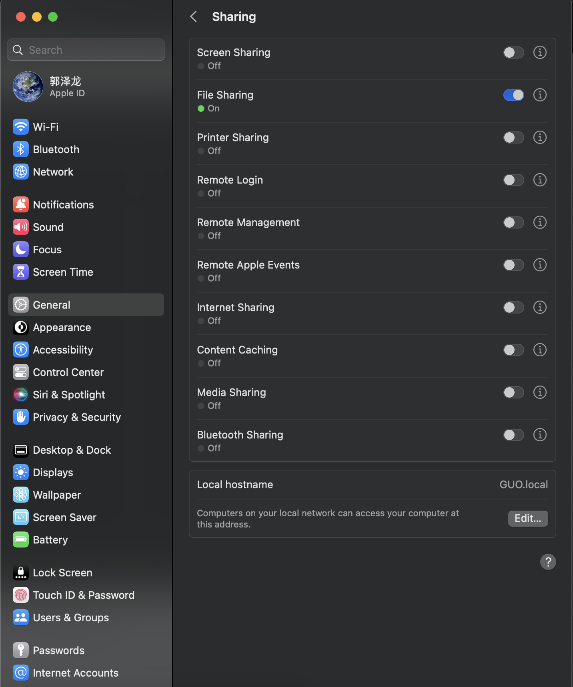
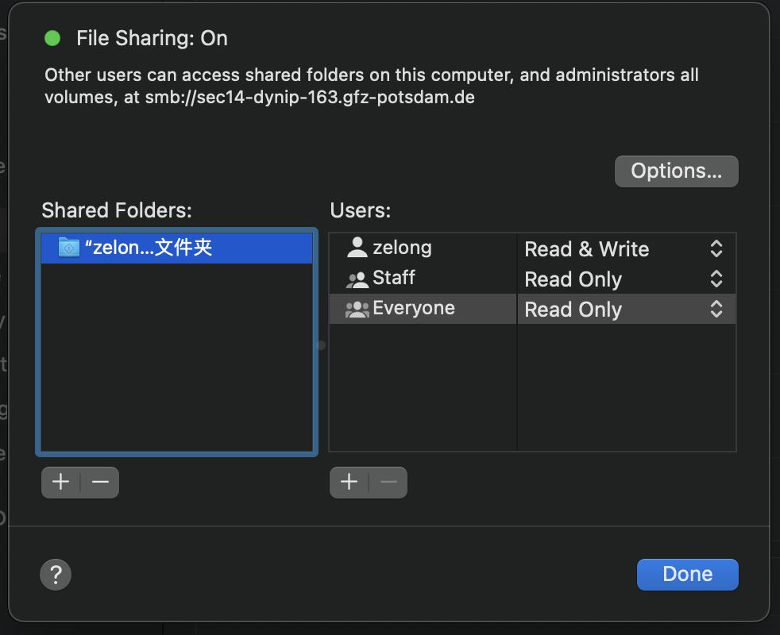
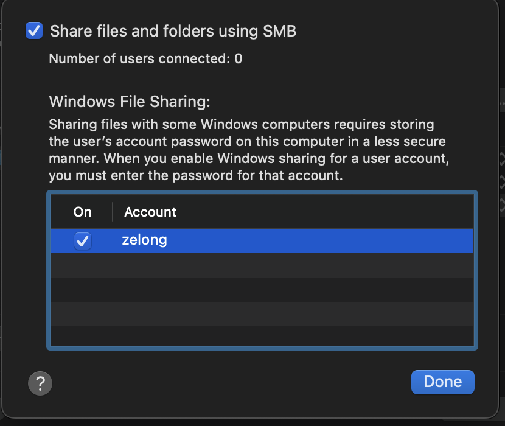
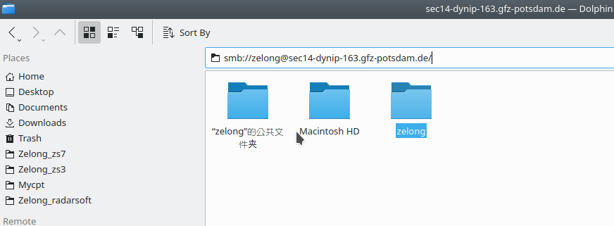

> Zelong Guo  
2022.1.30, GFZ, Potsdam

#### This note is about how to share files between Mac and my computer.

To do this, we actually used a very simple way, we share files in Mac so the computer can get access to the files in Mac. It's very simple.  

**<1>. Open *File Sharing* in *General* of your Mac.**  
  

**<2>. Click the "i" button in the above picture and then yuo can get the following image:**  
  

**<3>. Click the "Options..." of the above picture and then you can set the *account* and *password*.**  
Note: if you are required to input the KDE wallet password, you can search the KDE wallet in your computer (not you Mac), and then disable it.

**<4>. then you can get access to the shared folder from your computer by typing:*sam://sec14-dynip-163.gfz-potsdam.de*(see the detials in 2nd image) in the Dolphin window:**  
  

#### Now you see you have made it, you can get the files in your Mac.
